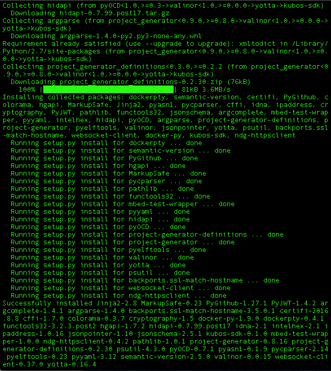

# Installing KubOS-SDK

## Prerequisites

### Install Docker

If you don't already have Docker installed see the Docker downloads for [Mac OS X](https://www.docker.com/products/docker-toolbox) or the installation docs for [Linux](https://docs.docker.com/engine/installation/). You should also read the [prerequisites](https://docs.docker.com/docker-for-mac/#/what-to-know-before-you-install).

		$ docker --version

The Kubos-SDK has been tested on Docker version 1.11.1 and 1.12.0.

### Install pip

If pip is already installed, ensure that your version is up to date with

        $ pip --version

and

        $ pip install --upgrade pip

or if you have permissions issues:

        $ pip install --user python --upgrade pip

You should not need to use `sudo`.
Similarly, you may need to upgrade other tools, such as `setuptools`.
Further, Mac OS X's new security model ("System Integrity Protection") may make
the upgrades impossible without declaring that you want to use `pip` as the
"python" user.

        $ pip install --user python --upgrade  setuptools

#### Linux
##### Ubuntu/Debian

		$ sudo apt-get install python-pip

##### Fedora

		$ sudo yum upgrade python-setuptools
		$ sudo yum install python-pip python-wheel

For other Linux distributions, see the  [pip installation guide](https://pip.pypa.io/en/stable/installing/).

##### Mac OS X

Using easy_install:

		$ sudo easy_install pip

Using homebrew:

		$ brew install pip

Using macports:

        $ sudo port install py-pip pip_select

You should ensure that your PATH variable includes the directory where
these executables are installed. Some software installers use the
`/Users/yourusername/Library/Python/2.7/bin` directory, which means
you would have to include this directory in the `/etc/paths` file
(and note this
file is owned by root and must therefore be edited using `sudo`).
If `kubos update` or any other `kubos` command is not working, this
change may provide a solution.

## Installing Dependencies

There are several different libraries that KubOS-SDK relies on. Some of these are needed just to install the SDK and some are required for running the sdk. Below are installation commands for several popular Linux distros. Those running OS X should not need to install additional libraries.

#### Linux
##### Ubuntu/Debian

        $ sudo apt-get install build-essential libxml2-dev libxslt1-dev zlib1g-dev  wget python-dev  libffi-dev libssl-dev python-setuptools libjim-dev libdw-dev

##### Fedora

        $ sudo yum install gcc redhat-rpm-config python-devel libffi-devel openssl-devel python-setuptools jimtcl

##### OpenSuse

        $ sudo zypper install gcc python-dev libffi-dev openssl-devel python-setuptools dracut systemd-sysvinit udev

## Installing KubOS-SDK

The KubOS-SDK is distributed using the python package system pip. You can install using this command:

		$ pip install kubos-sdk

or

        $ pip install --user python kubos-sdk

(to avoid those potential permissions errors on Mac OS X).

Things should progress for a few minutes, followed by a screen that mostly looks like the following:

--- 
 
 ---

KubOS-SDK is currently only supported in 64-bit OSX and Linux environments.

Next, start Docker's service or daemon. If you get an error that says

`Error: Unable to communicate with the Docker service. Please ensure this service is running and you have permission to access it.`

you have not started the Docker service.

Pull the latest Kubos-SDK Docker container:

		$ kubos update

And, as before, if the command fails, the `kubos` binary may not be present in your PATH variable.
